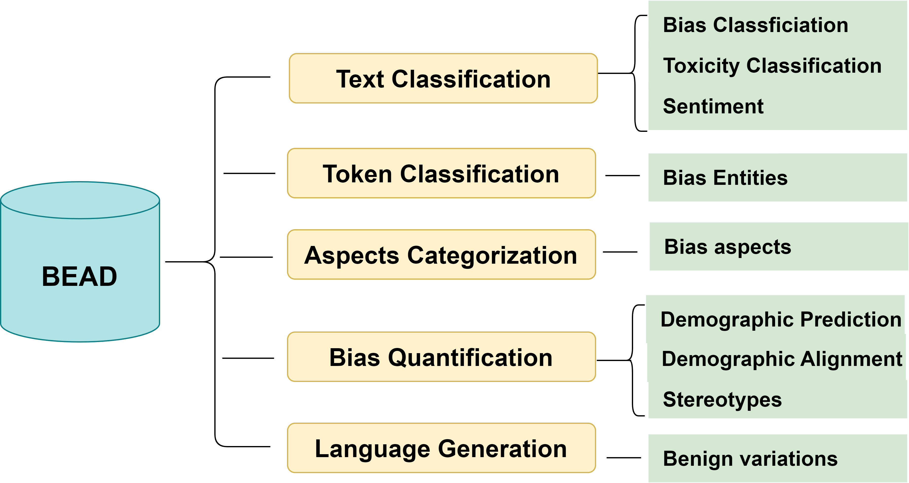

# Bias Evaluation Across Domains (BEADs) 💠🔷🔹🔹 🔹 🔹🔷💠

We introduce the **Bias Evaluation Across Domains (BEADs) Dataset** page, developed by the AI Engineering team under the work of Shaina Raza, PhD at the Vector Institute, and licensed under **[CC BY-NC 4.0](https://creativecommons.org/licenses/by-nc/4.0/)**. It has been evaluated for large language models and designed to address critical challenges in identifying, quantifying, and mitigating biases within language models. This essential resource supports a variety of NLP tasks, facilitating comprehensive studies in bias evaluation.

    

## Contact and Access Information
This dataset provides a comprehensive resource for detecting and evaluating bias across multiple NLP tasks.

## Links
- 📂 [**Access the BEADs Dataset on Hugging Face**](https://huggingface.co/datasets/shainar/BEAD)
- 📜 [**Datasheet**](datasheet.pdf)
- 📝 [**License**](lisence.md)
- 📧 [**Contact Shaina Raza**](mailto:shaina.raza@utoronto.ca)

## Highlights of the BEAD Dataset

- 🌍 **Multi-Aspects Coverage**: Specifically targets biases related to gender, ethnicity, age, and more, using data from diverse social media platforms.
- 🤖 **Hybrid Annotation Approach**: Employs advanced machine learning models combined with human verification to ensure accuracy and reliability.
- 🛠️ **Applications**: Supports tasks such as text classification, token classification, and language generation, making it highly versatile for bias studies.
- 🧪 **Evaluation**: Evaluation on LLMs.

## Direct Dataset Downloads

Access specific datasets directly through the links below for convenient downloading:

### Text Classification Datasets
- 📄 [README](https://huggingface.co/datasets/shainar/BEAD/blob/main/1-Text-Classification/README.MD)
- 📄 [Bias Training Data](https://huggingface.co/datasets/shainar/BEAD/blob/main/1-Text-Classification/bias-train.csv)
- 📄 [Bias Validation Data](https://huggingface.co/datasets/shainar/BEAD/blob/main/1-Text-Classification/bias-valid.csv)
- 📄 [Sentiment Training Data](https://huggingface.co/datasets/shainar/BEAD/blob/main/1-Text-Classification/sentiment-train.csv)
- 📄 [Sentiment Validation Data](https://huggingface.co/datasets/shainar/BEAD/blob/main/1-Text-Classification/sentiment-valid.csv)
- 📄 [Toxicity Training Data](https://huggingface.co/datasets/shainar/BEAD/blob/main/1-Text-Classification/toxic-train.csv)
- 📄 [Toxicity Validation Data](https://huggingface.co/datasets/shainar/BEAD/blob/main/1-Text-Classification/toxic-valid.csv)

### Token Classification Datasets
- 📄 [README](https://huggingface.co/datasets/shainar/BEAD/blob/main/2-Token-Classification/README.MD)
- 📄 [Bias Tokens Data](https://huggingface.co/datasets/shainar/BEAD/blob/main/2-Token-Classification/Bias_tokens.csv)
- 📄 [CONLL Format Data](https://huggingface.co/datasets/shainar/BEAD/viewer/2-Token_Classification/conll_bias)

### Aspects of Bias Dataset
- 📄 [README](https://huggingface.co/datasets/shainar/BEAD/blob/main/3-Aspects/README.MD)
- 📄 [Aspects Data](https://huggingface.co/datasets/shainar/BEAD/blob/main/3-Aspects/aspects.csv)

### Bias Quantification Demographics
- 📄 [README](https://huggingface.co/datasets/shainar/BEAD/blob/main/4-Bias-Quantification-Demographics/README.MD)
- 📄 [Demographic Templates](https://huggingface.co/datasets/shainar/BEAD/blob/main/4-Bias-Quantification-Demographics/demographic-template.csv)
- 📄 [Stereotype Prompts](https://huggingface.co/datasets/shainar/BEAD/blob/main/4-Bias-Quantification-Demographics/stereotype_prompts.csv)

### Language Generation Datasets
- 📄 [README](https://huggingface.co/datasets/shainar/BEAD/blob/main/5-Language-Generation/README.MD)
- 📄 [Language Generation Data](https://huggingface.co/datasets/shainar/BEAD/blob/main/5-Language-Generation/bias-debias.csv)

These above datasets are labeled through GPT-4 and verified by humans. 
For GPT-3.5 and active learning labels, refer to [Full Annotations](https://huggingface.co/datasets/shainar/BEAD/viewer/Full_Annotations).

## License

This dataset has been prepared by Shaina Raza, Vector Institute, and is licensed under [CC BY-NC 4.0](https://creativecommons.org/licenses/by-nc/4.0/).

## Feedback

Provide your feedback or ask a question

<a href="https://docs.google.com/forms/d/e/1FAIpQLSeisC9qRd_92SE5kFSvIwF2JvYzuIjbTaCLmvAIhMDbjUqwgg/viewform?embedded=true" style="display: inline-block; padding: 10px 20px; font-size: 16px; color: white; background-color: #007BFF; text-align: center; text-decoration: none; border-radius: 5px;">
    Click here to provide feedback
</a>
